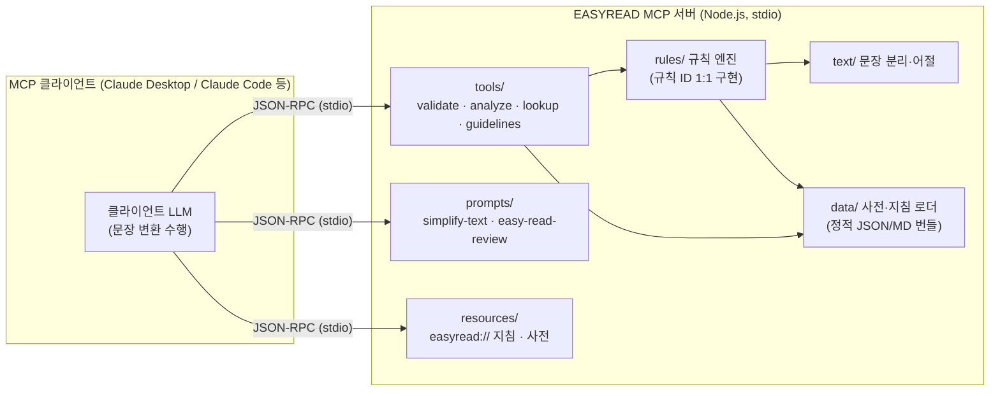

# 02. 아키텍처 설계 (PL)

> 작성 기준: `.claude/skills/pl` 워크플로 · 입력: [01-requirements.md](01-requirements.md), [validation-checklist.md](../../.claude/skills/easyread-domain/references/validation-checklist.md), [표준 근거 sources.md](../../.claude/skills/easyread-domain/references/sources.md)

## 1. 아키텍처 개요



데이터 흐름(S1 변환 시나리오 기준): 사용자가 `simplify-text` 프롬프트 실행 → 클라이언트 LLM이 지침·사전 도구를 호출하며 초안 작성 → `validate_easy_read`로 자체 검증 → 위반 수정 → 감수 전 초안 산출. **서버는 결정적 로직만 수행하며 텍스트를 저장·전송하지 않는다**(NFR-01·03).

## 2. 아키텍처 결정 기록 (ADR)

| ID | 결정 | 근거 | 기각한 대안 | 영향 |
|---|---|---|---|---|
| ADR-01 | 문장 변환 주체는 **클라이언트 LLM** (서버는 프롬프트·도구 제공) | API 키 불필요, 오프라인 동작(NFR-01), 프라이버시(NFR-03), 모든 MCP 클라이언트 호환 | (a) 서버의 LLM API 직접 호출 — 키·비용·개인정보 부담으로 기각. (b) MCP sampling — 클라이언트 지원이 불균일해 기각, 지원 확산 시 재검토 | 변환 품질 책임이 프롬프트 설계(FR-05)에 집중됨 |
| ADR-02 | **TypeScript + 공식 `@modelcontextprotocol/sdk`** | SDK 성숙도·레퍼런스 최다, npx 배포 용이(05 문서) | Python(FastMCP) — 형태소 분석 라이브러리 이점이 있으나 v0.1은 미사용(ADR-04)이라 이점 소멸 | Node 22+ 요구(NFR-05) |
| ADR-03 | 검증 규칙의 **단일 소스는 validation-checklist.md** | 문서·코드·테스트가 규칙 ID로 연결되어 불일치 방지. 규칙의 국제·국내 표준 근거(Inclusion Europe·ISO 24495·IFLA·국립장애인도서관 등)는 sources.md에 규칙 ID↔조항으로 매핑 | 코드 주석을 소스로 — 비개발자(도메인 감수자)가 검토 불가하여 기각 | 규칙 변경 절차: 문서 수정 → 코드 → 골든 테스트 |
| ADR-04 | 형태소 분석기 **v0.1 제외**, 휴리스틱+사전 매칭 | 의존성·용량 최소화, `자동` 등급 규칙은 휴리스틱으로 충분 | kiwi 계열 WASM 즉시 도입 — 초기 복잡도 대비 이득 불확실 | `보조` 규칙은 warning/info로만 보고. 도입 조건: 파일럿에서 보조 규칙 오탐이 사용성 문제로 확인될 때 |
| ADR-05 | transport는 **stdio 우선** | 로컬 사용이 1차 시나리오, 설정 단순 | Streamable HTTP 동시 지원 — 인증·배포 복잡도 증가로 M3 이후 백로그 | 원격 공유는 v0.1 범위 밖(FR-11) |
| ADR-06 | 데이터는 **패키지 번들 정적 파일** (JSON/Markdown) | 시드 규모(수백 건)에 DB 불필요, 오프라인 보장 | SQLite/외부 API — 과잉 설계로 기각 | 데이터 갱신 = 패키지 릴리스(05 문서 버전 전략과 연동) |
| ADR-07 | **Easy-Read 근거·표준·사례 카탈로그(62건)를 정적 데이터 자산 + MCP 리소스로 노출** (`easyread://resources`) | 발달장애인법 제10조·CRPD 등 권위 근거와 국내외 표준·실물 사례를 클라이언트가 조회·인용 가능. 규칙 근거의 투명성(ADR-03) 강화, 다국적 표준이 임계값을 뒷받침함을 노출 | (a) 규칙으로 흡수 — 대부분 글꼴·삽화·당사자검증 항목이라 텍스트 규칙 범위 밖이므로 기각. (b) **런타임 URL fetch** — 오프라인·결정성(NFR-01) 위반이라 기각 | **오프라인 정적 메타데이터로만 노출**(URL은 참조값, 런타임 fetch 금지). `url_status`·조사시점 보존. 범위 밖 항목은 guidelines/PROC 안내로만 |
| ADR-08 | **소소한소통 「쉬운정보 가이드라인 1.0」을 국내 실무 1차 기준으로 채택**하고 반영 범위를 규정 | 사용자 제공 원천 가이드라인(3대 실행원칙·세부기준 색인). 텍스트 층위(§8.2 어휘·§8.3 문장·§8.5 숫자)는 기존 VOC/SEN/NUM과 정합 → 명사화·긴 수식(§8.3.6)만 신규 **SEN-07**(보조)로 승격. 3대 실행원칙은 ISO 24495-1(찾기·이해·사용)과 정합 | (a) 3대 실행원칙 체계로 규칙군 재편 — 기존 IE 기반 규칙군·골든 테스트 전면 개편 비용 과다로 기각. (b) VOC-07(용어 일관성) 동시 승격 — 동의어/개념 사전 미보유로 오탐 커 백로그 유지 | **SEN-07 추가**(단일 소스 validation-checklist + 골든 테스트 sen-07). §7 탐색·§9 활용은 텍스트 린터 범위 밖 → guidelines/PROC로만. 카탈로그에 가이드라인 1.0 + 해외 Plain Language 벤치마크 3건(미국·캐나다·NZ) 추가(62→66) |

## 3. MCP 인터페이스 명세

서버 식별: `name: "easyread"`, 도구·프롬프트·리소스는 아래가 전부다(v0.1). **이 명세가 Backend·QA의 계약이다.**

### 3.1 Tools

#### `validate_easy_read` (FR-01, FR-07, FR-10)
- 설명(도구 description에 그대로 사용): "한국어 텍스트가 쉬운 정보(Easy-Read) 작성 지침을 지키는지 검사한다. 쉬운 정보 초안을 만들었거나 검토할 때 반드시 호출한다. 원문(original)을 함께 주면 날짜·금액 등 사실 보존까지 검사한다."
- 입력 (zod):

| 필드 | 타입 | 필수 | 제약 |
|---|---|---|---|
| `text` | string | ✅ | 1~50,000자 |
| `original` | string | — | 지정 시 ACC 규칙군 활성화 |
| `config.maxWordsWarning` | number | — | 기본 10 (SEN-01) |
| `config.maxWordsError` | number | — | 기본 15 (SEN-01) |
| `config.excludeRules` | string[] | — | 규칙 ID 배열 |

- 출력 `structuredContent` (validation-checklist "리포트 형식 규약" 준수):

```jsonc
{
  "verdict": "pass" | "needs-review" | "fail",   // fail = error 1개 이상
  "summary": { "errors": 0, "warnings": 2, "infos": 1, "byGroup": { "SEN": 1, "VOC": 2 } },
  "violations": [
    { "ruleId": "SEN-01", "severity": "warning", "message": "문장이 깁니다(어절 12개).",
      "span": { "start": 0, "end": 48 }, "excerpt": "…", "suggestion": "두 문장으로 나누세요." }
  ],
  "notices": ["이 결과는 당사자 감수를 대체하지 않습니다. …(PROC-01~03)"]
}
```

- `content`(text)에는 사람이 읽을 요약 리포트를 함께 반환.
- 오류: 빈 `text` → MCP 오류(입력 검증), 50,000자 초과 → "나눠서 검사" 안내 오류, `original`만 있고 `text` 없음 → 입력 검증 오류.

#### `analyze_readability` (FR-02)
- 입력: `text` (string, 필수, 1~50,000자)
- 출력: `{ charCount, sentenceCount, paragraphCount, avgWordsPerSentence, maxSentence: { excerpt, words, index }, difficultWordCount, difficultWords: [{ word, count }], numbersDetected }`
- 오류: 빈 입력 검증.

#### `lookup_easy_word` (FR-03)
- 입력: `word` (string, 필수, 1~50자), `limit` (number, 기본 5 — 유사 항목 수)
- 출력: `{ found: boolean, entry?: { word, category, alternatives: string[], explanation?, example?, source }, related: [{ word, category }] }`
- 미등재어: `found: false` + `related`(부분 일치 후보). 오류가 아님에 주의.

#### `get_guidelines` (FR-04)
- 입력: `section` (enum: `"전체" | "문장" | "어휘" | "숫자" | "구성" | "표기" | "절차" | "정확성"`)
- 출력: `content`에 해당 영역 지침 Markdown, `structuredContent`: `{ section, ruleIds: string[] }`

### 3.2 Prompts

| 이름 | 인자 | 생성 메시지 뼈대 |
|---|---|---|
| `simplify-text` (FR-05) | `text`(필수), `audience`(선택, 기본 "발달장애인 등 낮은 문해력 독자") | ① 역할·목적 ② 변환 절차(guidelines §6의 7단계, 도구 호출 지시 포함) ③ 정확성 원칙(§7 절대 규칙) ④ 출력 형식(제목·목록 구조) ⑤ **"당사자 감수 전 초안" 고지 포함 지시** ⑥ 원문 |
| `easy-read-review` (FR-08) | `text`(필수), `original`(선택) | ① 검토자 역할 ② `validate_easy_read` 호출 후 위반을 규칙 ID로 인용하며 수정안 제시 지시 ③ 사실 대조 지시(원문 제공 시) |

### 3.3 Resources (FR-09)

| URI | 내용 | MIME |
|---|---|---|
| `easyread://guidelines` | 작성 지침 전문 (번들 Markdown) | `text/markdown` |
| `easyread://guidelines/checklist` | 검증 규칙 체크리스트(규칙 ID 표) | `text/markdown` |
| `easyread://dictionary` | 단어 사전 전체 | `application/json` |
| `easyread://resources` | Easy-Read 근거·표준·사례 카탈로그(66건: 지침·법령·사례·포털, ADR-07·08) | `application/json` |

## 4. 데이터 모델

`assets/` 아래 정적 번들(ADR-06). 로딩 시 zod 스키마 검증, 실패 시 기동 중단.

```jsonc
// assets/dictionary.json
{
  "version": "0.1.0",           // 데이터 버전 (05 버전 전략과 연동)
  "updatedAt": "2026-08-09",
  "entries": [
    {
      "word": "구비서류",
      "category": "difficult",   // difficult | loanword | terminology | idiom | abbreviation
      "alternatives": ["필요한 서류"],
      "explanation": "제출해야 하는 서류",   // terminology일 때 뜻풀이 문형에 사용
      "example": "필요한 서류를 가져오세요.",
      "source": "자체 구축(국립국어원 쉬운 언어 자료 참고)"   // NFR-04 출처 표기
    }
  ]
}
```

- `assets/guidelines/*.md` — 영역별 지침(easyread-domain references에서 파생·동기화)
- `assets/rules-config.json` — 규칙별 기본 심각도·임계값 (validation-checklist 표와 1:1)
- 상대 날짜 어휘(NUM-03)·기호 목록(TYP-01) 등 규칙 전용 소량 데이터는 rules-config에 포함
- `assets/resources.json` (ADR-07·08) — Easy-Read 근거·표준·사례·법령 카탈로그(66건). 필드: `id·region·org_type·organization·title·category[]·language·year·url·url_status·description` + `meta`. 로더는 dictionary와 동일 패턴(zod 검증, 기동 시 1회), `url_status`·조사시점 보존, **런타임 URL fetch 금지**

## 5. 모듈 구조

```
src/
  index.ts        # 엔트리: shebang, 서버 기동, 데이터 로드 실패 시 종료
  server.ts       # McpServer 조립 — 도구·프롬프트·리소스 등록만 담당
  tools/          # 도구 핸들러 (validate.ts, analyze.ts, lookup.ts, guidelines.ts)
  prompts/        # 프롬프트 템플릿 (simplify.ts, review.ts)
  rules/          # 규칙 엔진: registry.ts, types.ts, sen/, voc/, num/, str/, typ/, acc/
  text/           # 문장 분리, 어절 계산, span 유틸 (최하위 계층)
  data/           # 번들 데이터 로더 + zod 스키마
assets/           # dictionary.json, guidelines/, rules-config.json
```

의존 방향(위반 금지): `tools → rules → text`, `tools/rules → data`, `text`는 무의존. `server.ts`는 조립만 하고 로직을 갖지 않는다.

## 6. WBS

| ID | 작업 | 산출물 | 선행 | 완료 기준 | 마일스톤 |
|---|---|---|---|---|---|
| T-01 | 프로젝트 스캐폴딩 | package.json, tsconfig, vitest, lint 설정 | — | `npm run build`·`test` 통과(빈 테스트) | M1 |
| T-02 | 문장 분리·어절 모듈 | `src/text/` + 단위 테스트 | T-01 | 경계 케이스(따옴표·숫자 마침표) 테스트 통과 | M1 |
| T-03 | 규칙 엔진 코어 | registry, 타입, 리포트 조립기 | T-02 | 더미 규칙 1개로 리포트 스키마 검증 | M1 |
| T-04 | SEN 규칙군 | `rules/sen/` + 골든 테스트 | T-03 | TC-SEN-* 전체 통과 | M1 |
| T-05 | 서버 뼈대 + validate 등록 | index/server/tools/validate | T-04 | **MCP Inspector에서 SEN 검증 동작** | M1 |
| T-06 | 사전 스키마·시드 데이터 | assets/dictionary.json (100건 이상) | T-01 | zod 검증 통과, 출처 필드 100% | M2 |
| T-07 | VOC·NUM·STR·TYP 규칙군 | rules/* + 골든 테스트 | T-04, T-06 | 각 규칙군 TC 통과 | M2 |
| T-08 | 나머지 도구 3종 | analyze, lookup, guidelines | T-06 | 계약 테스트(TC-TOOL-*) 통과 | M2 |
| T-09 | 프롬프트 2종 + 리소스 | prompts/, 리소스 등록 | T-05 | FR-05 AC(3요소 포함) 검사 통과 | M2 |
| T-10 | ACC 규칙군 | rules/acc/ + 테스트 | T-04 | TC-ACC-* 통과 | M2 |
| T-11 | 통합·성능 테스트 | InMemory transport 계약 테스트, NFR-02 벤치 | T-08~10 | 전 FR AC 자동 검증, 10k자 1초 이내 | M2 |
| T-12 | 배포 파이프라인 | CI, npm publish, 설치 가이드 | T-11 | 05 문서 릴리스 절차 통과, npx 설치 검증 | M3 |
| T-13 | 파일럿 | 실문서 10건 변환·감수 기록 | T-12 | 성공 지표 4종 측정 완료 | M3 후 |
| T-14 | Easy-Read 자료 카탈로그 리소스 (ADR-07) | assets/resources.json + zod 로더 + `easyread://resources` + 골든·계약 테스트 | T-06, T-09 | 62건 zod 검증·리소스 계약 테스트 통과 (W: 테스트, U: 로더·자산·핸들러) | M2 |
| T-16 | 소소한소통 가이드라인 1.0 반영 (ADR-08) | SEN-07 규칙 + 골든 테스트 · 카탈로그 4건 추가(62→66) · sources/guidelines/checklist 갱신 | T-07, T-14 | TC-SEN-07-* 통과 · 카탈로그 66건 zod·계약 테스트 통과 (W: 스펙·테스트, U: 규칙 구현·자산) | M2 |

## 7. 마일스톤

| 마일스톤 | 정의(DoD) | 포함 작업 |
|---|---|---|
| **M1 — 걷는 뼈대** | MCP Inspector에서 `validate_easy_read`(SEN 규칙군)가 동작하는 것을 눈으로 확인. SEN 골든 테스트 CI 통과 | T-01~T-05 |
| **M2 — 기능 완성** | FR Must+Should 전부 구현, 전 규칙군 골든 테스트·계약 테스트·NFR-02 성능 통과 | T-06~T-11 |
| **M3 — 공개 배포** | npm 공개, `npx` 설치 검증, 설치 5분 지표 테스트 통과 | T-12 |

## 8. 리스크와 대응

| ID | 리스크 | 대응 |
|---|---|---|
| R-01 | 사전 데이터 저작권·품질 | 자체 재구성 원칙(NFR-04), 항목별 출처 필드 의무화, 공개 전 저작권 검토 |
| R-02 | `보조` 규칙 오탐으로 도구 신뢰 하락 | 기본 심각도를 warning/info로 제한, 골든셋에 오탐 방지 케이스 배치(04 문서), 오탐 허용선 정의 |
| R-03 | MCP SDK/스펙 변화 | SDK 버전 캐럿 고정, 구현 착수 시 공식 문서 재확인(backend 스킬 규약), 스펙 리비전 확인을 릴리스 체크리스트에 포함 |
| R-04 | 파일럿·감수 협력처 미확보 | M2 완료 전 유관 기관 접촉 시작(PM 액션), 미확보 시 성공 지표 4번을 차기로 이월 |

## 9. 변경 이력

| 날짜 | 변경 | 작성 |
|---|---|---|
| 2026-08-09 | 최초 작성 | PL (pl 스킬) |
| 2026-08-09 | 규칙 표준 근거 반영 — ADR-03에 sources.md(규칙 ID↔표준 조항) 연결, 입력에 표준 출처 추가 | Backend (표준 감사) |
| 2026-08-11 | ADR-07(자료 카탈로그 리소스) 추가 — `easyread://resources`·데이터모델·WBS T-14 반영, 62건 근거 카탈로그 연결 | PL (W / pl 스킬) |
| 2026-08-13 | ADR-08(소소한소통 가이드라인 1.0 반영) 추가 — SEN-07 규칙 승격, 카탈로그 62→66(벤치마크 미국·캐나다·NZ), §7·§9 범위 밖 명시, WBS T-16 | PL (W / pl 스킬) |
